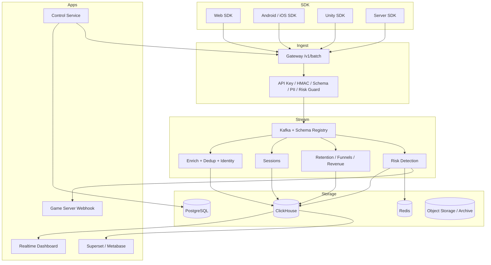

# Oddsmaker

Oddsmaker 是一套面向单个游戏公司的实时分析与风控平台。

它的定位是一家公司内部统一管理多个游戏、多个环境的数据基础设施。核心隔离边界是 `game_id + environment`。

## What Oddsmaker Means

`Oddsmaker` 来自赌场和博彩行业，指负责制定赔率的人。这个角色本质上依赖两类能力：

- 数据判断：根据历史行为、概率分布、市场变化和结果反馈不断修正判断。
- 风险控制：赔率不是随便拍脑袋给的，背后一定包含敞口控制、异常识别和动态调整。

这个名字适合当前项目，因为平台的目标也不是单纯“收集事件”，而是把游戏数据分析、实验优化和风险控制放到同一条链路里。

## Product Positioning

- 单公司部署：一家公司部署一套 Oddsmaker，不做多个公司共用的 SaaS。
- 多游戏管理：一套平台支持多个游戏。
- 多环境隔离：每个游戏可以有 `dev`、`staging`、`prod` 等环境。
- 风控内建：风控不是外挂模块，而是接入、计算、告警、处置的主链路能力。

## Core Capabilities

### 1. Real-Time Game Analytics

- 实时采集 Web、Android、iOS、Unity、Server 事件
- 会话、留存、漏斗、收入、关卡、虚拟经济、广告分析
- A/B 实验配置、分流、曝光事件与结果分析
- 统一 `game_id + environment` 数据边界

### 2. Risk Control

- Gateway 前置校验：API Key、HMAC、时间窗、重放、限流、PII
- 实时检测：脚本行为、异常资源增长、支付异常、广告奖励异常、账号/设备/IP 聚集
- 风险输出：`mark`、`alert`、`block`、`review`、`throttle`、Webhook
- 风险事件与证据落库，支持回溯分析

### 3. Data Governance

- Tracking Plan / Schema 治理
- JSON Schema + Avro + Registry
- 属性白名单、PII 策略、事件大小限制
- 所有新接入统一使用 `game_id + environment`

## Architecture



## Canonical Data Boundary

新架构下的核心键：

```text
game_id      = 游戏标识，例如 game_demo
environment  = dev | staging | prod
event_id     = 单事件唯一 ID
```

事件、分区、查询、实验和风控规则都应使用这组边界键。

## Repository Layout

- `services/gateway-service/`：采集入口、协议校验、限流、PII、前置风控
- `services/control-service/`：游戏、环境、密钥、策略、实验、风控管理
- `jobs/flink/`：富化、去重、会话、留存、漏斗、风控等流式作业
- `libs/`：公共模型、鉴权、Kafka、可观测性组件
- `schema/`：Avro、JSON Schema、ClickHouse DDL、查询脚本
- `sdks/`：Web、Android、iOS、Unity SDK
- `bi/`：Superset 资源
- `infra/`：Docker Compose、K8s、Helm、Grafana、Prometheus
- `docs/`：架构、API、运维、重设计、路线图

## Quick Start

本地基础设施：

```bash
docker-compose -f infra/docker-compose.yml up -d
```

体验脚本：

```bash
bash scripts/e2e.sh
bash scripts/superset-import.sh
```

流式任务：

```bash
bash scripts/run_flink.sh
```

说明：

- 当前仓库没有根目录 Gradle Wrapper，不能直接假设 `./gradlew` 可用。
- 如果要跑 Java 服务，需要你本地已有 Gradle 或补充 wrapper。

## Current Direction

当前优先目标是完成这几件事：

1. 把全仓库事件契约统一到 `game_id + environment`
2. 控制面只围绕 Game / Environment / API Key / Risk Policy 建模
3. 把风控链路从“概念设计”补成“可运行主链路”
4. 统一 SDK、Gateway、Flink、ClickHouse、Control 的字段和命名

## Documentation

- [总体文档入口](docs/README.md)
- [系统架构](docs/reference/architecture.zh.md)
- [重设计方案](docs/redesign/README.zh.md)
- [采集 API](docs/reference/api.zh.md)
- [控制面](docs/reference/control.zh.md)
- [路线图](docs/roadmap.zh.md)
- [运维文档](docs/operations/README.md)

## Tech Stack

- Java 21
- Spring Boot 3 WebFlux
- Kafka + Apicurio Schema Registry
- Flink
- ClickHouse
- PostgreSQL
- Redis
- OpenTelemetry + Prometheus + Grafana
- Superset

## Status

项目仍处于创建早期，但核心模型已经定下来。

已经明确的方向：

- 品牌名固定为 `Oddsmaker`
- Git remote 已切到 `git@github.com:cuihairu/oddsmaker.git`
- 包名已统一到 `io.oddsmaker`
- 架构目标固定为“单公司、多游戏、多环境、风控内建”

尚在持续收口的部分：

- SDK 公开 API 统一
- Flink / SQL / BI / 文档全链路改名
