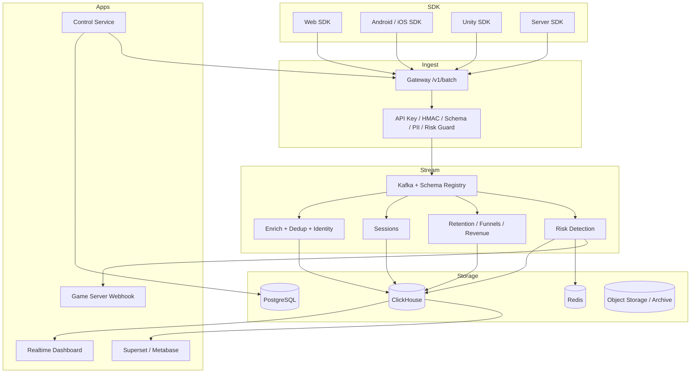

<div align="center">


# Oddsmaker

[](https://github.com/cuihairu/oddsmaker/actions/workflows/ci.yaml)
[](https://cuihairu.github.io/oddsmaker/)
[](LICENSE)

</div>

Oddsmaker 是一套面向单个游戏公司的实时分析与风控平台。

它的定位是一家公司内部统一管理多个游戏、多个环境的数据基础设施。核心隔离边界是 `game_id + environment`。

## What Oddsmaker Means

`Oddsmaker` 来自赌场和博彩行业，指负责制定赔率的人。这个角色本质上依赖两类能力：

- 数据判断：根据历史行为、概率分布、市场变化和结果反馈不断修正判断。
- 风险控制：赔率不是随便拍脑袋给的，背后一定包含敞口控制、异常识别和动态调整。

这个名字适合当前项目，因为平台的目标也不是单纯“收集事件”，而是把游戏数据分析、实验优化和风险控制放到同一条链路里。

## Product Positioning

- 单公司部署：一家公司部署一套 Oddsmaker，不做多个公司共用的 SaaS。
- 多游戏管理：一套平台支持多个游戏。
- 多环境隔离：每个游戏可以有 `dev`、`staging`、`prod` 等环境。
- 存储路由解耦：环境表达发布阶段，物理数据路由由 `storage_profile` 决定。
- 风控内建：风控不是外挂模块，而是接入、计算、告警、处置的主链路能力。

## Core Capabilities

### 1. Real-Time Game Analytics

- 实时采集 Web、Android、iOS、Unity、Server 事件
- 会话、留存、漏斗、收入、关卡、虚拟经济、广告分析
- A/B 实验配置、分流、曝光事件与结果分析
- 统一 `game_id + environment` 数据边界

### 2. Risk Control

- Gateway 前置校验：API Key、HMAC、时间窗、重放、限流、PII
- 实时检测：脚本行为、异常资源增长、支付异常、广告奖励异常、账号/设备/IP 聚集
- 风险输出：`mark`、`alert`、`block`、`review`、`throttle`、Webhook
- 风险事件与证据落库，支持回溯分析

### 3. Data Governance

- Tracking Plan / Schema 治理
- JSON Schema + Avro + Registry
- 属性白名单、PII 策略、事件大小限制
- 所有新接入统一使用 `game_id + environment`

## Architecture


```mermaid
flowchart TB
    subgraph SDK
        Web[Web SDK]
        Mobile[Android / iOS SDK]
        Unity[Unity SDK]
        Server[Server SDK]
    end

    subgraph Ingest
        Gateway[Gateway /v1/batch]
        Guard[API Key / HMAC / Schema / PII / Risk Guard]
    end

    subgraph Stream
        Kafka[Kafka + Schema Registry]
        Enrich[Enrich + Dedup + Identity]
        Session[Sessions]
        Analytics[Retention / Funnels / Revenue]
        Risk[Risk Detection]
    end

    subgraph Storage
        ClickHouse[(ClickHouse)]
        Postgres[(PostgreSQL)]
        Redis[(Redis)]
        Archive[(Object Storage / Archive)]
    end

    subgraph Apps
        Control[Control Service]
        Dashboard[Realtime Dashboard]
        BI[Superset / Metabase]
        Webhook[Game Server Webhook]
    end

    Web --> Gateway
    Mobile --> Gateway
    Unity --> Gateway
    Server --> Gateway
    Gateway --> Guard
    Guard --> Kafka
    Kafka --> Enrich
    Kafka --> Session
    Kafka --> Analytics
    Kafka --> Risk
    Enrich --> ClickHouse
    Session --> ClickHouse
    Analytics --> ClickHouse
    Risk --> ClickHouse
    Risk --> Redis
    Risk --> Webhook
    Control --> Postgres
    Control --> Gateway
    ClickHouse --> Dashboard
    ClickHouse --> BI
```

## Canonical Data Boundary

新架构下的核心键：

```text
game_id      = 游戏标识，例如 game_demo
environment  = dev | staging | prod
storage_profile = shared-nonprod | shared-prod | dedicated-*
event_id     = 单事件唯一 ID
```

事件、分区、查询、实验和风控规则都应使用 `game_id + environment` 作为逻辑边界。
`storage_profile` 只负责物理路由，不进入事件契约。

## Repository Layout

- `services/gateway-service/`：采集入口、协议校验、限流、PII、前置风控
- `services/control-service/`：游戏、环境、密钥、策略、实验、风控管理
- `jobs/flink/`：富化、去重、会话、留存、漏斗、风控、维度同步等流式作业
- `agents/`：`dimension-sync-agent`——游戏方内网部署的维度同步器（零仓库内依赖）
- `ml/`：`oddsmaker-ml` 训练管线——churn / pltv / risk 可训练模型（Python，含启发式基线对照）
- `libs/`：公共模型、鉴权、Kafka、可观测性组件
- `schema/`：Avro、JSON Schema、ClickHouse DDL、查询脚本
- `sdks/`：Web、Android、iOS、Unity SDK
- `bi/`：Superset 资源
- `infra/`：Docker Compose、K8s、Helm、Grafana、Prometheus
- `docs/`：架构、API、运维、重设计、路线图

## Quick Start

### Docker Compose 快速搭建（推荐）

一条命令拉起服务端（control + gateway 单镜像）与全部依赖（PostgreSQL / Redis / Kafka / Apicurio / ClickHouse），端口、卷、健康检查齐全：

```bash
# 可选：复制环境配置并按需修改端口 / 密码 / Token（全部有中文注释）
cp .env.example .env

docker compose -f docker-compose.quickstart.yml up -d

# 查看健康状态（全部 healthy 即就绪）
docker compose -f docker-compose.quickstart.yml ps

# 验证 API
curl http://localhost:38085/actuator/health   # control（管理面）
curl http://localhost:38080/actuator/health   # gateway（采集入口）
```

### 单容器运行（Docker 镜像）

镜像为单镜像双服务：`ghcr.io/cuihairu/oddsmaker`，运行时用 `SERVICE` 环境变量选择 `control`（8085）或 `gateway`（8080）：

```bash
docker pull ghcr.io/cuihairu/oddsmaker:nightly

# 控制服务（SERVICE=control）
docker run -d --name oddsmaker-control \
  -p 38085:8085 \
  -e SERVICE=control \
  -e SPRING_DATASOURCE_URL=jdbc:postgresql://<pg>:5432/oddsmaker \
  -e ODDSMAKER_ADMIN_TOKEN=dev-admin-token \
  ghcr.io/cuihairu/oddsmaker:nightly

# 网关服务（SERVICE=gateway）
docker run -d --name oddsmaker-gateway \
  -p 38080:8080 \
  -e SERVICE=gateway \
  -e ODDSMAKER_KAFKA_BOOTSTRAP=<kafka>:9092 \
  -e ODDSMAKER_CONTROL_URL=http://<control>:8085 \
  -e ODDSMAKER_CONTROL_INTERNAL_TOKEN=dev-internal-token \
  ghcr.io/cuihairu/oddsmaker:nightly
```

### 本地构建镜像（Dockerfile）

根目录 `Dockerfile` 为多阶段构建（Gradle 编译 → `eclipse-temurin:21-jre-alpine` 运行），以非 root 用户运行，内置 healthcheck；构建上下文必须是仓库根：

```bash
docker build -t ghcr.io/cuihairu/oddsmaker:local .
```

镜像 tag 口径：CI 每日/每次 main 推送推 `:nightly`（nightly-build.yml），发版时推 `:<version>` 与 `:latest`（release.yaml）。

### Nightly 构建产物

每日 UTC 00:00（及每次 main 推送）CI 全量测试通过后，在 [Releases](https://github.com/cuihairu/oddsmaker/releases) 页发布滚动 nightly 构建（tag 固定 `nightly`）：Linux x64/arm64、macOS x64/arm64、Windows x64 五平台服务端分发包（control + gateway + 6 个 Flink 作业 fatJar + 维度同步 agent + Web 控制台/SDK 静态资源 + 启动脚本），包内含 `BUILD_INFO`，Release 附 `VERIFY.md`（全资产 SHA256）。

### 源码开发

体验脚本与流式任务：

```bash
bash scripts/e2e.sh
bash scripts/superset-import.sh
bash scripts/run_flink.sh
```

说明：

- 全量测试：`./gradlew test --continue`（Gradle Wrapper 8.10.1，JDK 21）。
- Web 控制台：`pnpm -C web test && pnpm -C web build`（开发态 `pnpm -C web dev`，代理到 control 8085）。

## Current Direction

当前优先目标是完成这几件事：

1. 把全仓库事件契约统一到 `game_id + environment`
2. 控制面只围绕 Game / Environment / API Key / Risk Policy 建模
3. 把风控链路从“概念设计”补成“可运行主链路”
4. 统一 SDK、Gateway、Flink、ClickHouse、Control 的字段和命名

## Documentation

- [总体文档入口](docs/README.md)
- [系统架构](docs/zh/reference/architecture.md)
- [环境与存储路由设计](docs/zh/reference/environment-and-storage.md)
- [重设计方案](docs/zh/redesign/index.md)
- [采集 API](docs/zh/reference/api.md)
- [控制面](docs/zh/reference/control.md)
- [路线图](docs/zh/analysis/roadmap.md)
- [运维文档](docs/operations/index.md)

## Tech Stack

- Java 21
- Spring Boot 3 WebFlux
- Kafka + Apicurio Schema Registry
- Flink
- ClickHouse
- PostgreSQL
- Redis
- OpenTelemetry + Prometheus + Grafana
- Superset

## Status

项目仍处于创建早期，但核心模型已经定下来。

已经明确的方向：

- 品牌名固定为 `Oddsmaker`
- Git remote 已切到 `git@github.com:cuihairu/oddsmaker.git`
- 包名已统一到 `io.oddsmaker`
- 架构目标固定为“单公司、多游戏、多环境、风控内建”

尚在持续收口的部分：

- SDK 公开 API 统一
- Flink / SQL / BI / 文档全链路改名
