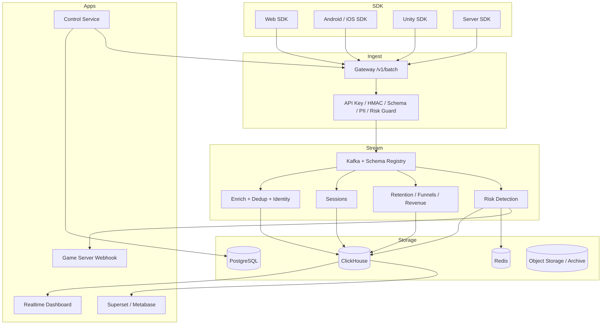

[English](README.md) | [中文](README.zh.md)

<div align="center">


# Oddsmaker

[](https://github.com/cuihairu/oddsmaker/actions/workflows/ci.yaml)
[](https://cuihairu.github.io/oddsmaker/)
[](LICENSE)

</div>

Oddsmaker is a real-time analytics and risk control platform built for a single gaming company.

It is positioned as the data infrastructure through which one company manages multiple games across multiple environments. The core isolation boundary is `game_id + environment`.

## What Oddsmaker Means

`Oddsmaker` comes from the casino and betting industry and refers to the person responsible for setting odds. The role fundamentally relies on two capabilities:

- Data judgment: continuously refining assessments based on historical behavior, probability distributions, market changes, and outcome feedback.
- Risk control: odds are never set arbitrarily; behind them there is always exposure control, anomaly identification, and dynamic adjustment.

The name fits this project because the platform's goal is likewise not merely to "collect events", but to place game data analytics, experiment optimization, and risk control on a single pipeline.

## Product Positioning

- Single-company deployment: one company deploys one Oddsmaker instance; it is not a SaaS shared by multiple companies.
- Multi-game management: one platform supports multiple games.
- Multi-environment isolation: each game can have environments such as `dev`, `staging`, and `prod`.
- Decoupled storage routing: the environment expresses the release stage, while physical data routing is determined by `storage_profile`.
- Built-in risk control: risk control is not a bolt-on module but a core-pipeline capability spanning ingestion, computation, alerting, and disposition.

## Core Capabilities

### 1. Real-Time Game Analytics

- Real-time ingestion of events from the Web, Android, iOS, Unity, and Server SDKs
- Session, retention, funnel, revenue, level progression, virtual economy, and ad analytics
- A/B experiment configuration, traffic splitting, exposure events, and results analysis
- A unified `game_id + environment` data boundary

### 2. Risk Control

- Gateway pre-validation: API key, HMAC, time window, replay, rate limiting, PII
- Real-time detection: scripting behavior, abnormal resource growth, payment anomalies, ad-reward anomalies, and account/device/IP clustering
- Risk outputs: `mark`, `alert`, `block`, `review`, `throttle`, and webhooks
- Risk events and evidence persisted for retrospective analysis

### 3. Data Governance

- Tracking Plan / schema governance
- JSON Schema + Avro + Registry
- Property allowlists, PII policies, and event size limits
- All new integrations uniformly use `game_id + environment`

## Architecture


```mermaid
flowchart TB
    subgraph SDK
        Web[Web SDK]
        Mobile[Android / iOS SDK]
        Unity[Unity SDK]
        Server[Server SDK]
    end

    subgraph Ingest
        Gateway[Gateway /v1/batch]
        Guard[API Key / HMAC / Schema / PII / Risk Guard]
    end

    subgraph Stream
        Kafka[Kafka + Schema Registry]
        Enrich[Enrich + Dedup + Identity]
        Session[Sessions]
        Analytics[Retention / Funnels / Revenue]
        Risk[Risk Detection]
    end

    subgraph Storage
        ClickHouse[(ClickHouse)]
        Postgres[(PostgreSQL)]
        Redis[(Redis)]
        Archive[(Object Storage / Archive)]
    end

    subgraph Apps
        Control[Control Service]
        Dashboard[Realtime Dashboard]
        BI[Superset / Metabase]
        Webhook[Game Server Webhook]
    end

    Web --> Gateway
    Mobile --> Gateway
    Unity --> Gateway
    Server --> Gateway
    Gateway --> Guard
    Guard --> Kafka
    Kafka --> Enrich
    Kafka --> Session
    Kafka --> Analytics
    Kafka --> Risk
    Enrich --> ClickHouse
    Session --> ClickHouse
    Analytics --> ClickHouse
    Risk --> ClickHouse
    Risk --> Redis
    Risk --> Webhook
    Control --> Postgres
    Control --> Gateway
    ClickHouse --> Dashboard
    ClickHouse --> BI
```

## Canonical Data Boundary

Core keys under the target architecture:

```text
game_id      = game identifier, e.g. game_demo
environment  = dev | staging | prod
storage_profile = shared-nonprod | shared-prod | dedicated-*
event_id     = unique ID per event
```

Events, partitions, queries, experiments, and risk rules all use `game_id + environment` as the logical boundary.
`storage_profile` is responsible for physical routing only and never enters the event contract.

## Repository Layout

- `services/gateway-service/`: ingestion entry point, protocol validation, rate limiting, PII, and pre-ingest risk control
- `services/control-service/`: games, environments, keys, policies, experiments, and risk management
- `jobs/flink/`: streaming jobs for enrichment, deduplication, sessions, retention, funnels, risk detection, dimension synchronization, and more
- `agents/`: `dimension-sync-agent` — a dimension synchronizer deployed inside the game studio's intranet (zero in-repo dependencies)
- `ml/`: the `oddsmaker-ml` training pipeline — four trainable model families (churn / pltv / risk / propensity) in Python, with heuristic baselines for comparison
- `libs/`: shared models, authentication, Kafka, and observability components
- `schema/`: Avro, JSON Schema, ClickHouse DDL, and query scripts
- `sdks/`: Web, Android, iOS, Unity, and Server SDKs
- `bi/`: Superset resources
- `infra/`: Docker Compose, K8s, Helm, Grafana, Prometheus
- `docs/`: architecture, API, operations, redesign, and roadmap

## Quick Start

### Demo Site

Demo site: https://oddsmaker.cuihairu.site/ | Demo account `demo` / `EBluYQvTaeN78p` (for trial use; data is reset periodically)

> The demo site is for trial purposes only: data is reset periodically, so do not store real business data there. The demo account has the read-only VIEWER role.
> For private deployment, follow the Docker Compose path below.

### Quick Setup with Docker Compose (Recommended)

A single command brings up the server side (control + gateway in a single image) together with all dependencies (PostgreSQL / Redis / Kafka / Apicurio / ClickHouse), with ports, volumes, and health checks fully configured:

```bash
# Optional: copy the environment config and adjust ports / passwords / tokens as needed (comments in Chinese)
cp .env.example .env

docker compose -f docker-compose.quickstart.yml up -d

# Check health status (ready once every service is healthy)
docker compose -f docker-compose.quickstart.yml ps

# Verify the APIs
curl http://localhost:38085/actuator/health   # control (management plane)
curl http://localhost:38080/actuator/health   # gateway (ingestion entry)
```

### Single-Container Run (Docker Image)

The image ships two services in a single artifact: `ghcr.io/cuihairu/oddsmaker`. At runtime, the `SERVICE` environment variable selects `control` (8085) or `gateway` (8080):

```bash
docker pull ghcr.io/cuihairu/oddsmaker:nightly

# Control service (SERVICE=control)
docker run -d --name oddsmaker-control \
  -p 38085:8085 \
  -e SERVICE=control \
  -e SPRING_DATASOURCE_URL=jdbc:postgresql://<pg>:5432/oddsmaker \
  -e ODDSMAKER_ADMIN_TOKEN=dev-admin-token \
  ghcr.io/cuihairu/oddsmaker:nightly

# Gateway service (SERVICE=gateway)
docker run -d --name oddsmaker-gateway \
  -p 38080:8080 \
  -e SERVICE=gateway \
  -e ODDSMAKER_KAFKA_BOOTSTRAP=<kafka>:9092 \
  -e ODDSMAKER_CONTROL_URL=http://<control>:8085 \
  -e ODDSMAKER_CONTROL_INTERNAL_TOKEN=dev-internal-token \
  ghcr.io/cuihairu/oddsmaker:nightly
```

### Building the Image Locally (Dockerfile)

The root `Dockerfile` is a multi-stage build (Gradle compilation → `eclipse-temurin:21-jre-alpine` runtime), runs as a non-root user, and includes a built-in healthcheck; the build context must be the repository root:

```bash
docker build -t ghcr.io/cuihairu/oddsmaker:local .
```

Image tagging: CI publishes `:nightly` on the daily schedule and on every push to main (nightly-build.yml), and publishes `:<version>` and `:latest` on releases (release.yaml).

### Nightly Build Artifacts

After the full CI test suite passes, a rolling nightly build (tag fixed at `nightly`) is published on the [Releases](https://github.com/cuihairu/oddsmaker/releases) page at 00:00 UTC daily and on every push to main: server distribution packages for five platforms — Linux x64/arm64, macOS x64/arm64, and Windows x64 — containing control + gateway, six Flink job fatJars, the dimension-sync agent, Web console/SDK static assets, and startup scripts. Each package carries a `BUILD_INFO` file, and each release includes `VERIFY.md` (SHA256 checksums for all assets).

### Working from Source

To try out the scripts and streaming jobs:

```bash
bash scripts/e2e.sh
bash scripts/superset-import.sh
bash scripts/run_flink.sh
```

Notes:

- Full test suite: `./gradlew test --continue` (Gradle Wrapper 8.10.1, JDK 21).
- Web console: `pnpm -C web test && pnpm -C web build` (for development, `pnpm -C web dev`, which proxies to control on 8085).

## Current Direction

The current priorities are:

1. Unify the event contract across the entire repository to `game_id + environment`
2. Model the control plane strictly around Game / Environment / API Key / Risk Policy
3. Build the risk control pipeline out from "conceptual design" into a "runnable main pipeline"
4. Unify fields and naming across the SDKs, Gateway, Flink, ClickHouse, and Control

## Documentation

- [Documentation index](docs/README.md)
- [System architecture](docs/zh/reference/architecture.md)
- [Environment and storage routing design](docs/zh/reference/environment-and-storage.md)
- [Redesign plan](docs/zh/redesign/index.md)
- [Ingestion API](docs/zh/reference/api.md)
- [Control plane](docs/zh/reference/control.md)
- [Roadmap](docs/zh/analysis/roadmap.md)
- [Operations](docs/operations/index.md)

## Tech Stack

The foundation is built on open-source components: Spring Boot, Kafka, Flink, ClickHouse, PostgreSQL, Redis, Superset, and others; what this repository implements itself is the wiring, the business layers, and the SDKs.

- Java 21
- Spring Boot 3 WebFlux
- Kafka + Apicurio Schema Registry
- Flink
- ClickHouse
- PostgreSQL
- Redis
- OpenTelemetry + Prometheus + Grafana
- Superset

## Status

The current version is `v0.2.0 (unreleased)`; the repository's positioning and naming have converged:

- The brand name is fixed as `Oddsmaker`, and the package namespace is unified as `io.oddsmaker`
- The architecture goal is fixed as "single company, multiple games, multiple environments, built-in risk control"
- Git remote: `https://github.com/cuihairu/oddsmaker.git`

Delivered capabilities: ingestion gateway (`/v1/batch` + event contract v2), control plane (games / environments / keys / 8-role permissions / experiments / risk rules), seven Flink jobs (enrich/sessions/retention/funnels/risk/dimension/identity-merge), the dimension-sync agent (five source types), SDKs for five platforms, training and batch scoring for four ML model families, and the web console.

Restructure 2.0 batches B1–B10 have all been accepted, including event contract v2 increments, Server SDK, gateway authoritative backfill with self-raised rejection, the risk feature layer (`risk_features` with three-stage decoupling of FEATURE rule values), the RiskScore/Decision state machine, EventSchema as a first-class resource, experiment platform formalization, the runtime mode matrix, and data quality with a shared feature store; further work proceeds batch by batch per `todo.md`.
