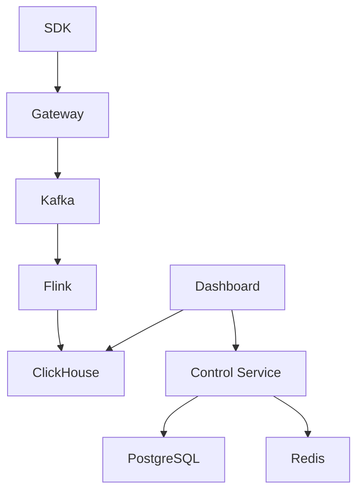

## Quick Start

```bash
# Clone the repository
git clone https://github.com/cuihairu/oddsmaker.git

# Start the local infrastructure
cd oddsmaker
docker-compose -f infra/docker-compose.yml up -d

# Access the API
curl http://localhost:8085/actuator/health
```

## Architecture



## Key Features

### Multi-Game Support
Manage multiple games with isolated environments, API keys, and configurations.

### Real-time Processing
Process millions of events per second with Kafka + Flink + ClickHouse pipeline.

### Risk Control
Detect and prevent cheating, payment fraud, and other suspicious activities.

### A/B Test Analysis
Analyze experiment results with conversion rates, statistical significance testing, and Sample Ratio Mismatch (SRM) detection. Track exposure events and measure uplift across variants.

### Predictive Models
- **Churn Prediction** - Identify players likely to churn before they leave
- **Fraud Detection** - Detect cheating and suspicious behavior patterns
- **LTV Forecasting** - Predict player lifetime value for acquisition optimization
- **Risk Scoring** - Real-time risk assessment for transactions and actions

### Enterprise Security
MFA, SSO, RBAC, audit logging, and compliance features.

## Documentation

- [Getting Started](/guide/) - Quick start guide
- [API Reference](/reference/) - Complete API documentation
- [Operations](/operations/) - Deployment and operations guides

## Community

- [GitHub Issues](https://github.com/cuihairu/oddsmaker/issues) - Report bugs and request features
- [Discussions](https://github.com/cuihairu/oddsmaker/discussions) - Ask questions and share ideas

## License

Oddsmaker is released under the [MIT License](https://opensource.org/licenses/MIT).
