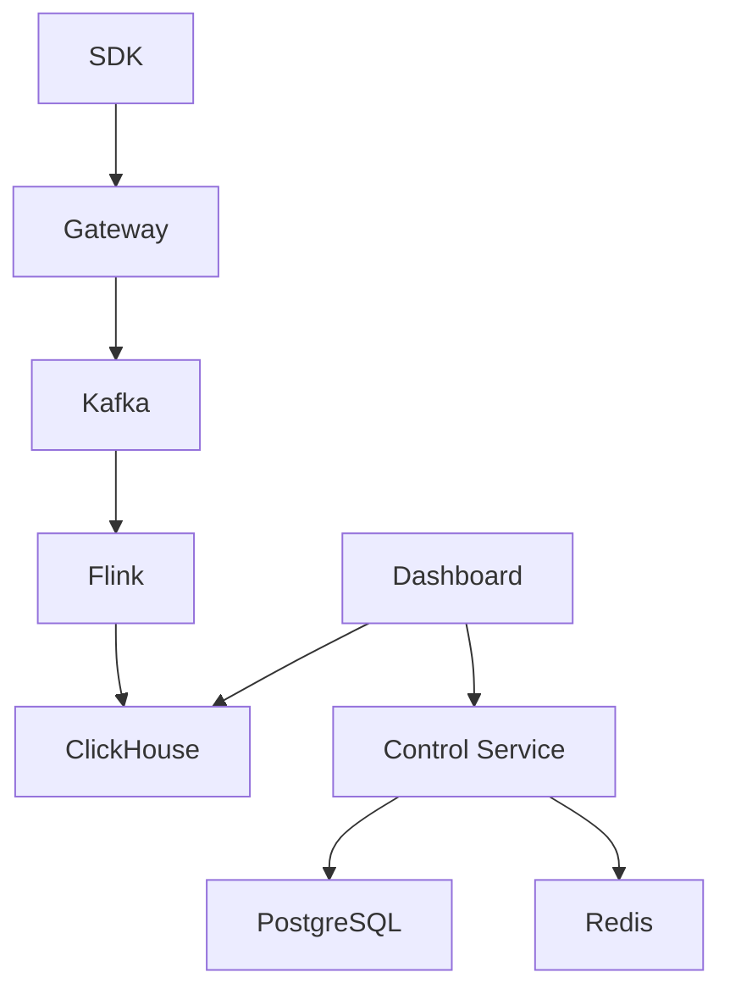

## Quick Start

```bash
# Clone the repository
git clone https://github.com/cuihairu/oddsmaker.git

# Enter the project directory
cd oddsmaker

# Optional: adjust ports / passwords / tokens (see .env.example)
cp .env.example .env

# Start quick local orchestration (recommended, uses non-conflicting ports + Chinese comments)
docker compose -f docker-compose.quickstart.yml up -d

# Or use Docker single service startup
# docker pull ghcr.io/cuihairu/oddsmaker:nightly
# docker run -d --name oddsmaker-control -p 38085:8085 -e SERVICE=control ...

# Access the API
curl http://localhost:38085/actuator/health
```

## Architecture


```mermaid
graph TB
    SDK[SDK] --> Gateway[Gateway]
    Gateway --> Kafka[Kafka]
    Kafka --> Flink[Flink]
    Flink --> ClickHouse[ClickHouse]
    Control[Control Service] --> PostgreSQL[PostgreSQL]
    Control --> Redis[Redis]
    Dashboard[Dashboard] --> ClickHouse
    Dashboard --> Control
```

## Key Features

### Multi-Game Support
Manage multiple games with isolated environments, API keys, and configurations.

### Real-time Processing
Event pipeline built on Kafka + Flink + ClickHouse (design target 10k–50k events/s per node, see operations/perf-tuning).

### Risk Control
Detect and prevent cheating, payment fraud, and other suspicious activities.

### A/B Test Analysis
Analyze experiment results with conversion rates, statistical significance testing, and Sample Ratio Mismatch (SRM) detection. Track exposure events and measure uplift across variants.

### Predictive Models
- **Churn Prediction** - Identify players likely to churn before they leave
- **Risk Scoring** - Risk assessment for suspicious behavior (heuristic baseline + trained model)
- **LTV Forecasting** - Predict player lifetime value (D7→D30 multiplier model)
- **Payment Propensity** - Score likelihood of a player making a purchase

### Enterprise Security
MFA (two-factor), RBAC with 8 roles and global/game/environment scopes, and full audit logging.

## Documentation

- [Getting Started](/guide/) - Quick start guide
- [API Reference](/reference/) - Complete API documentation
- [Operations](/operations/) - Deployment and operations guides

## Community

- [GitHub Issues](https://github.com/cuihairu/oddsmaker/issues) - Report bugs and request features
- [Discussions](https://github.com/cuihairu/oddsmaker/discussions) - Ask questions and share ideas

## License

Oddsmaker is released under the [MIT License](https://opensource.org/licenses/MIT).
