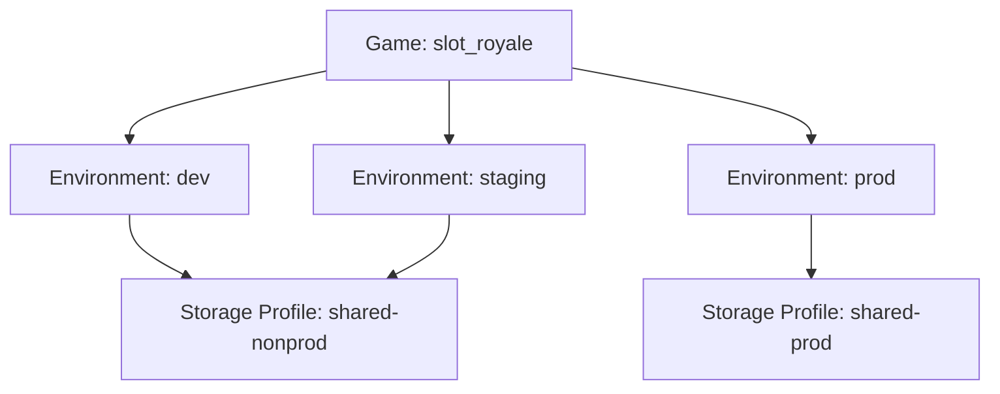
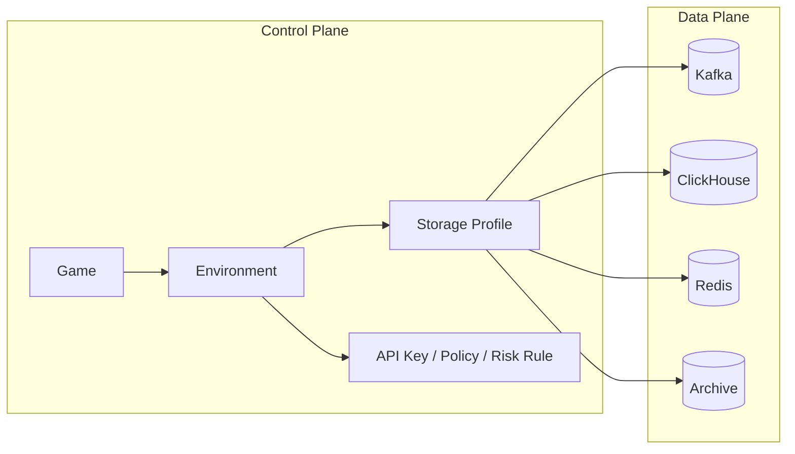

# Environment 与 Storage Profile 设计

Oddsmaker 的目标不是做一个“看起来很高级”的多租户 SaaS，而是为**单个游戏公司**提供一套真实可运维的多游戏分析与风控平台。

这意味着模型必须同时满足三件事：

- 同一家公司内部可以管理多个游戏
- 同一个游戏可以经历 `dev / staging / prod` 等发布阶段
- 生产与非生产数据面可以隔离，但不必把每个环境都拆成独立数据库

因此，Oddsmaker 采用：

`Game -> Environment -> StorageProfile`

不是：

- 只保留 `Game`
- 也不是“每个环境都是一个假 Game / 假 Project”
- 更不是“每个 `(game, env)` 默认独立一套数据库”

## 为什么不删除 Environment

`environment` 的职责是表达**发布阶段**，而不是表达公司、客户或存储物理边界。

保留 `environment` 的原因：

- 同一个游戏在 `dev/staging/prod` 下通常有不同 API Key、采样率、PII 策略和风控阈值
- 风控规则往往先在非生产环境验证，再进入生产
- 测试数据和生产数据必须隔离，但控制面不应为此复制成三套“假游戏”
- SDK、Gateway、Tracking Plan、实验和审计天然都需要环境语义

如果删除 `environment`，最终通常会退化成：

- `game-a-dev`
- `game-a-staging`
- `game-a-prod`

这种设计的表面好处是简单，但实际代价是：

- 控制面对象重复
- 规则和策略复制
- API Key 管理重复
- 报表与审计链路割裂

## 为什么引入 Storage Profile

`environment` 解决的是“逻辑阶段”，不是“物理存储”。

物理隔离应该单独建模，否则会把两个不同问题混在一起：

- `environment`: 这个游戏当前运行在什么阶段
- `storage_profile`: 这个环境的数据应该路由到哪套 Kafka / ClickHouse / Redis / Archive

这样做的直接好处：

- 非生产环境可以共享一套低成本后端
- 生产环境可以独立后端，避免测试污染生产
- 头部游戏可以单独切到专属后端，而不需要修改事件协议
- 控制面仍然围绕 `game + environment` 工作，不会被物理拓扑污染

## 核心模型

### 1. Game

业务对象。

示例：

- `game_id = slot_royale`
- `game_id = poker_arena`

### 2. Environment

逻辑发布阶段。

推荐固定枚举：

- `dev`
- `qa`
- `staging`
- `prod`
- `loadtest`

当前默认创建：

- `dev`
- `staging`
- `prod`

### 3. StorageProfile

数据面路由配置。

它描述的是：

- Kafka cluster / topic namespace
- ClickHouse cluster / database routing
- Redis cluster
- Archive bucket
- 隔离策略

## 推荐策略

Oddsmaker 不支持无限制自定义隔离模式，而是推荐少量受控策略。

### `SHARED`

所有环境共用同一套后端。

适用：

- 本地开发
- 演示
- 小规模 PoC

优点：

- 成本最低
- 部署最简单

缺点：

- 生产与测试隔离弱

### `PROD_ISOLATED`

`prod` 使用独立 profile，`dev/qa/staging` 共用非生产 profile。

适用：

- 正常生产默认方案

优点：

- 避免测试数据污染生产
- 成本和隔离的平衡最好

缺点：

- 比 `SHARED` 多一套后端资源

### `DEDICATED`

某个 `game + environment` 独占后端。

适用：

- 头部游戏
- 高流量生产环境
- 强合规或高风险业务

优点：

- 隔离最强
- 易于独立扩容

缺点：

- 成本和运维复杂度最高

## 推荐默认值

Oddsmaker 推荐：

- 非生产：`shared-nonprod`
- 生产：`shared-prod`
- 特殊大游戏：按需升级到 `dedicated`

也就是说，平台推荐默认不是“全部共享”，也不是“全部独立”，而是：

**生产独立，非生产共享。**

## 图示

### 逻辑模型

### 数据面映射

## 设计收益

### 对分析链路

- 事件协议继续保持 `game_id + environment`
- 不需要把存储拓扑暴露给 SDK
- ClickHouse / Kafka / Redis 可以按 profile 演进

### 对风控链路

- 风控规则仍绑定 `game + environment`
- 生产环境能更严格，非生产可更宽松
- 生产 Redis 风控状态可独立，避免测试污染

### 对控制面

- 不必复制三套“假项目”
- 策略继承更自然：游戏级默认，环境级覆盖
- 后续可扩展 dedicated profile，不破坏上层资源模型

## 不采用的方案

### 方案一：删除 environment

不采用原因：

- 会把发布阶段语义塞进 game/project 名字
- API Key、规则、审计、实验会大量复制

### 方案二：每个 `(game, env)` 默认独立数据库

不采用原因：

- 运维成本过高
- 分析对象、DDL、报表和监控复制过多
- 对创建初期的项目过重

## 最终结论

Oddsmaker 的推荐模型是：

- `game_id` 负责业务隔离
- `environment` 负责阶段隔离
- `storage_profile` 负责物理隔离

这套模型比“只保留 game”更真实，也比“每个环境都拆独立库”更可运维。
