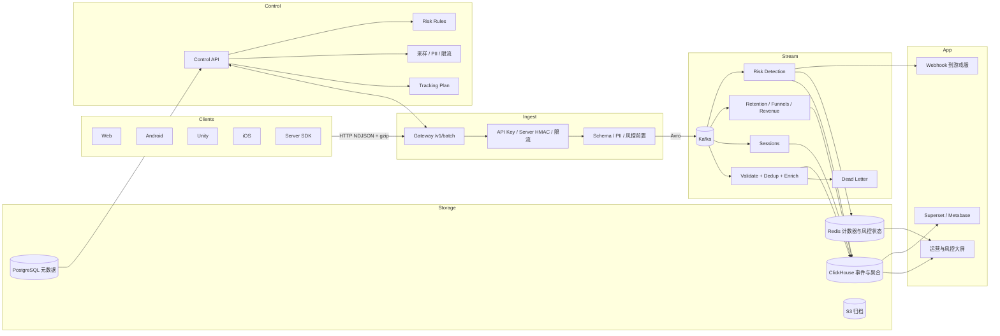

# Oddsmaker 全 Java 架构（单公司多游戏）

目标：为一个游戏公司内部提供多游戏、多环境的实时分析和风控平台。公司是部署边界，不做多公司共用的多租户 SaaS。

## 总览



## 核心边界

- 公司：部署级配置，不进入事件分区键。
- 游戏：核心业务对象，**每个游戏独立数据库**。
- 环境：`dev`、`staging`、`prod`，**表级别隔离**。
- 存储路由：**按游戏分库**，数据物理隔离。
- API Key：绑定 `game_id + environment`，路由到对应数据库。
- 权限：绑定全局、游戏或环境范围。
- 风控策略：绑定 `game_id + environment`，可灰度发布。

**数据库架构**：

```
oddsmaker_meta (元数据库)
├─ games
├─ environments  
├─ api_keys
├─ users
└─ audit_logs

game_demo_prod (游戏数据库)
├─ events
├─ sessions
├─ retention
├─ resource_changes
└─ risk_events

game_demo_staging
└─ (同样的表结构)

game_rpg_prod
└─ ...
```

推荐默认拓扑：

- `dev/staging` 共享非生产 ClickHouse 集群（不同库）
- `prod` 使用生产 ClickHouse 集群
- 每个游戏独立数据库，完全物理隔离

## 数据模型

事件核心字段：

- 标识：`event_id,event_type,event_name`（game_id 和 environment 在数据库/表层级）
- 身份：`device_id,user_id,player_id,character_id,session_id`
- 时间：`ts_client,ts_server,event_date`
- 客户端：`platform,app_version,sdk_version,country,user_agent`
- 游戏：`server_id,guild_id,match_id,level_id,game_mode,difficulty`
- 商业化：`order_id,product_id,revenue_amount,revenue_currency,receipt_hash`
- 虚拟经济：`resource_id,resource_amount,flow_type,item_id`
- 广告：`ad_network,ad_placement,ad_format,ad_impression_id`
- 风控：`risk_context,client_integrity,device_fingerprint`
- 扩展：`props,experiments,attribution`

ClickHouse 分区（每个游戏独立库）：

```sql
-- game_demo_prod.events
PARTITION BY (toYYYYMM(event_date))
ORDER BY (event_type, event_date, server_id, player_id, user_id, device_id, ts_server, event_id)
```

注意：`game_id` 和 `environment` 已在数据库/表名称中体现，不需要作为字段存储。

## 关键设计

- 幂等去重：客户端生成 `event_id`，Flink 按 `server_id + player_id + event_id` 去重。
- 乱序处理：Flink 使用事件时间和 watermark，迟到事件进入补偿链路。
- Schema 治理：Tracking Plan 管事件名、字段字典、枚举、cardinality 上限。
- 客户端安全：客户端只持 public `api_key`；HMAC 只用于 Server SDK。
- PII 治理：Gateway 执行 deny/mask/coarse，违规事件进入 DLQ。
- 风控闭环：Gateway 硬拦截，Flink 实时检测，ClickHouse 回溯，Webhook 输出处置。
- **数据隔离**：每个游戏独立数据库，物理隔离，互不影响。

## 风控能力

风控输入：

- IP、UA、API Key、签名、时间窗。
- 设备指纹、模拟器、Root/Jailbreak、调试器。
- 登录、支付、广告、关卡、资源流、对局结果。

风控输出：

- `risk_events`：每次命中规则的事实表。
- `risk_scores`：账号、设备、玩家、IP 的风险评分。
- `risk_actions`：block、review、mark、throttle、webhook。

## 组件与语言

- Java 21
- Spring Boot 3 WebFlux
- Kafka 3
- Flink 1.19
- ClickHouse 24
- PostgreSQL
- Redis
- Avro / JSON Schema / Apicurio Registry
- OpenTelemetry + Prometheus + Grafana

## 目录

- `schema/`：Avro/JSON Schema、ClickHouse DDL
- `libs/`：公共模型、鉴权、Kafka、OTel
- `services/gateway-service/`：采集入口
- `services/control-service/`：游戏、环境、密钥、策略、风控、权限
- `jobs/flink/`：富化、会话、留存、漏斗、风控等作业
- `sdks/`：Web、Android、iOS、Unity
- `bi/`：Superset 资源
- `infra/`：本地和部署编排
- `docs/`：架构、API、运维、路线图

## 演进顺序

1. **按游戏分库架构**：每个游戏独立 ClickHouse 数据库，物理隔离。
2. 接通单公司多游戏控制面。
3. 扩展游戏事件 v1。
4. 增加风控规则、实时检测和处置闭环。
5. 完善 LTV、广告、实验、Crash 和预测模型。
